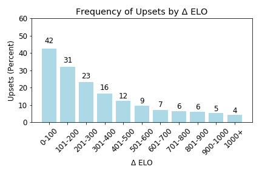
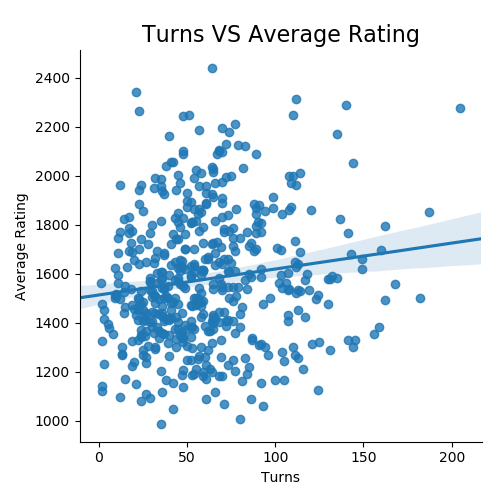

# Success in Chess: A data driven approach

## Abstract

Chess is the most popular board game in the world. It’s popularity continues to expand as it has become more accessible to play thanks to online services. Many of us have casually played a game of chess before (or at least heard of chess), but have never considered the consequences of the first move we take or the sophisticated strategies that have been developed by advanced players. Using chess match data obtained via Kaggle and Lichess, we answered several questions that had piqued our interest. From our results, we observed: the player who goes first has a slight statistical edge over the player who goes second, upsets are common however they occur much less frequently as the disparity in skill level widens, competitive matches often end in resignation rather than checkmate, matches tend to last longer when players are evenly matched, and that there are statistically favorable and unfavorable opening moves.

## Sample Results

